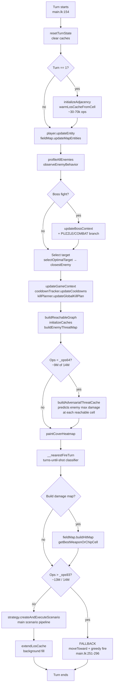
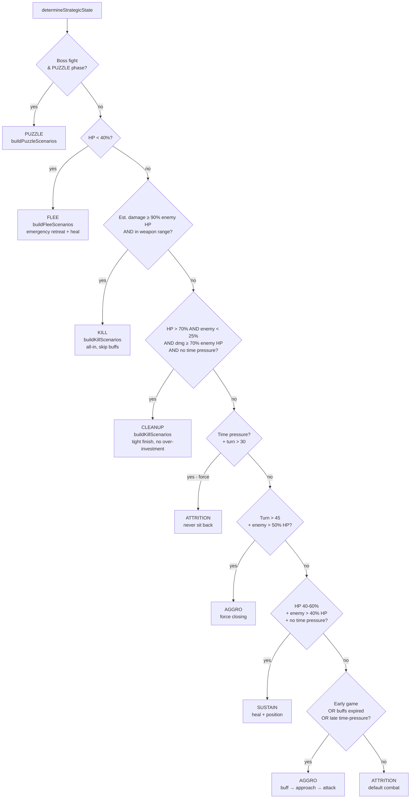
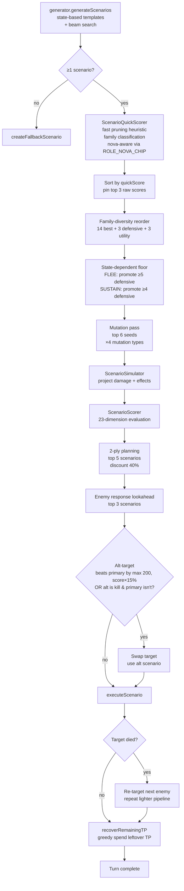
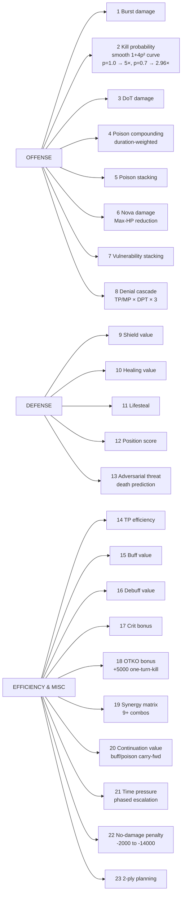
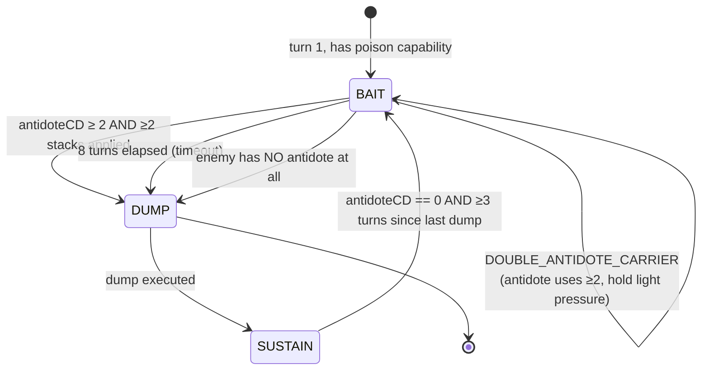
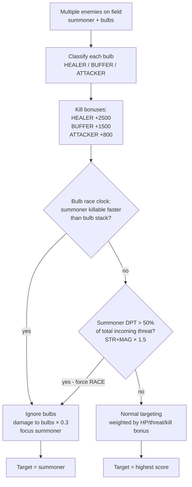
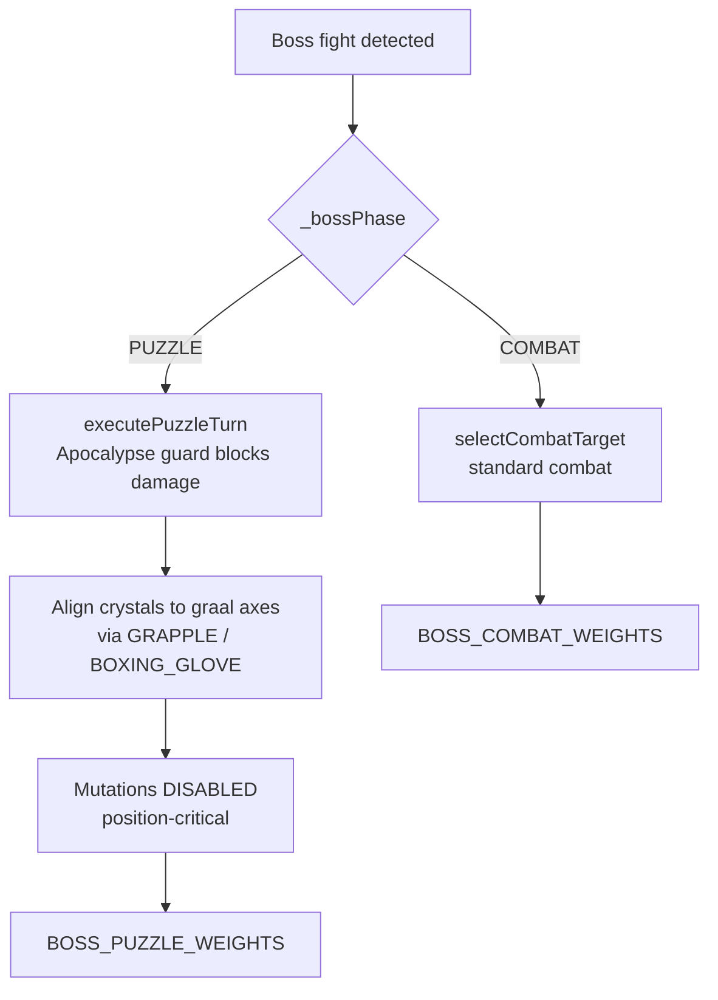
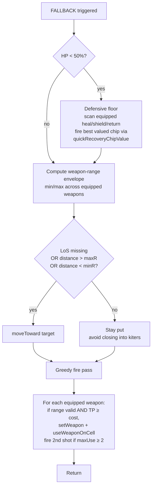

# V8 AI Decision-Making Schema

Visual reference for what the V8 AI does each turn. All diagrams are Mermaid
(viewable in GitHub, VS Code with the Mermaid extension, or any Mermaid live
editor). Line numbers reference the current `V8_modules/` source.

---

## 1. Per-Turn Pipeline (high level)

What runs from `main()` every turn, in order. Reference: `main.lk:154-321`.

**Key gates by ops budget** (init in `main.lk:80-118`):

| Gate | % of budget | Behavior |
|---|---|---|
| `_ops50` | 50% | alt-target counterfactual cutoff |
| `_ops64` | 64% | adversarial threat cache cutoff |
| `_ops71` | 71% | nearestFireTurn cutoff |
| `_ops93` | 93% | hard fallback (skip scenario pipeline) |
| `_opsBudget` | 100% | crash boundary — must finish under this |

---

## 2. Strategic State Decision (per turn)

Determined inside `scenario_generator.generateScenarios` via
`determineStrategicState()` (`scenario_helpers.lk:67`). Drives which family
of scenario templates is built.

After state selection, **beam search** (`beam_search.lk`) runs additionally if
state ∉ {PUZZLE, FLEE} and ops < _ops64 — adds discovered novel sequences to
the scenario pool. See `scenario_generator.lk:107-112`.

---

## 3. Scenario Pipeline (the main brain)

What `strategy.createAndExecuteScenario` actually does
(`strategy/unified_strategy.lk:42-121` and `generateAndEvaluateBestScenario`
at line 123). This is where the 23-dimension scoring lives.

### Mutation types (`scenario_mutation.lk`)
1. **Aim optimization** — shift AoE target ±1 for splash coverage
2. **Swap** — reorder adjacent actions for better sequencing
3. **Substitution** — replace chip with same-type alternative
4. **Insertion** — add unused chips into gaps

---

## 4. The 23 Scoring Dimensions

The scorer (`scenario_scorer.lk`) aggregates these into a single score per
scenario. Grouped by purpose:

**Build-specific weighting:** Each leek build (STR / Magic / Agility / STR-SCI
/ Tank-SCI / Hybrid / Bruiser-Reflect) loads a different weight profile from
`weight_profiles.lk` (~303 lines, 7 profiles × 23 weights). Same scorer code,
different multipliers — no build-specific branching in the scoring engine.

---

## 5. Poison State Machine (Magic builds only)

`scenario_generator.lk:15-60`. Drives MH's behavior against enemies that
carry Antidote.

**Double-antidote carrier detection** (`cooldown_tracker.lk`): the
`ANTIDOTE_USE_COUNT` global counts cleansing events per enemy. Once an enemy
has cleansed ≥ 2 times within a 12-turn window, the enemy profile gets
flagged `doubleAntidoteCarrier`. Effect:
- BAIT phase refuses to transition to DUMP (no all-in available)
- `strategic_depth.lk` pivots: `dotEffects × 0.6`, `poisonStacks × 0.6`,
  `burstDamage × 1.15`, `denialValue × 1.15`

- **BAIT**: light poisons + denial → trigger enemy's Antidote use
- **DUMP**: all-in poison (COVID, Arsenic, Plague, weapons) while Antidote on CD
- **SUSTAIN**: maintain stacks, heal, position; wait for next BAIT window

Checkpoint bonuses applied by scorer:
- `POISON_DUMP` mandatory: **+10,000**
- `POISON_BAIT` recommended: **+4,000**

---

## 6. Counter-Strategy Adaptation

`strategic_depth.lk` (~407 lines) — adapts the 23 weights based on enemy
profile after observation accumulates.

| Enemy archetype | Weight changes | When |
|---|---|---|
| **Kiter** | +distance, +heal, +DoT; −kiting penalty | T1 (profile-based) |
| **Burst** | +shields, +healing, +threat-awareness | T1 |
| **Tank** | Nova ×1.64, denial ×1.30, DoT ×1.20 | T1 |
| **Reflect (active)** | burst ×0.47, +shields, +healing | T1 |
| **Reflect carrier** (chip equipped, not active) | burst ×0.85 (preemptive) | T1 |
| **Carries antidote** | dotEffects ×1.15, denial ×1.15 in BAIT (skipped if MAG) | T1 |
| **No antidote chip** | burst ×1.15 (poison sticks, combos compound without cleanse-undo) | T1 |
| **No shield chips** | burst ×1.1 | T1 |
| **Double-antidote carrier** (cleansed ≥2×) | dotEffects ×0.6, poisonStacks ×0.6, burst ×1.15 | Reactive |
| **HP trending up** | burst ×1.3, denial ×1.5 | ≥5 obs |
| **Never shields** | burst ×1.2, shieldValue ×0.8 | ≥5 obs |

**Static vs dynamic split:** T1-applicable signals come straight from the
enemy's equipped chip list (Phase 2.2) — no observation gate. Dynamic signals
still require ≥5 turns of HP-trend data to avoid early misreads.

Cooldown-aware: when enemy's shield/heal is on CD, burst weight gets boosted
to exploit the window.

---

## 7. Bulb Targeting (multi-entity fights)

`scenario_scorer.lk` evaluates each enemy as a potential target. When
summons (bulbs) are on the field, target selection has its own decision
tree.

**Summoner-DPT override** addresses bulb pile-on losses where many low-DPT
bulbs (30-50 dmg/turn) drew fire away from the real threat (350-400
dmg/turn from the summoner). If `(summoner.STR + summoner.MAG) × 1.5 >
0.5 × incoming threat`, RACE is forced regardless of HP gap.

Our own summoning (when AI controls bulbs): Metallic (tank) when HP < 50%,
Savant (support) otherwise.

---

## 8. Boss Fight Branch (Fennel King)

Only active when `_isBossFight` is true (`main.lk:129-131, 179-192,
298-300`).

---

## 9. Fallback Path

Triggered when ops > `_ops93` (≥93% of budget consumed before scenario
pipeline) — `main.lk:251-296`.

---

## 10. Module Dependency Order (include chain)

Order matters in `main.lk`. Anything earlier in this list can be used by
anything later, not the other way around.

---

## 11. Where to look when

Quick navigation when debugging a specific behavior:

| Symptom / question | First file to open |
|---|---|
| "Why did it choose this state?" | `scenario_helpers.lk:67` (determineStrategicState) |
| "Why this scenario over another?" | `scenario_scorer.lk` (scoring), enable scenario debug |
| "Why didn't it use chip X?" | `scenario_combos.lk` (templates), `scenario_generator.lk` (build*Scenarios) |
| "Why did it stand still?" | `main.lk:251` fallback, or `unified_strategy.lk` no-scenario branch |
| "Why poison/heal at wrong time?" | `scenario_generator.lk:15-60` POISON state machine |
| "Wrong weapon at wrong range?" | `field_map_tactical.lk` buildHitMap, `scenario_simulator.lk` |
| "Boss puzzle stuck?" | `boss_context.lk` (1071 lines) |
| "Burned ops budget?" | check `_ops*` gates above + `performance_infra.lk` |
| "Why targeted a bulb over the summoner?" | `scenario_scorer.lk` bulb-race + summoner-DPT override |
| "ALTERATION / MUTATION never fires?" | `item_roles.lk` (ROLE_NOVA_CHIP) + `scenario_quick_scorer.lk` nova estimate |
| "T1 motivation wasted vs close enemy?" | `scenario_helpers.lk:720-759` getMotivationBuff distance gate |
